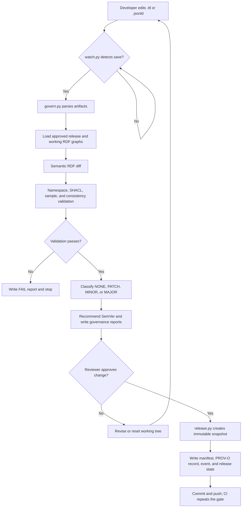

# Chubb Enterprise Ontology Governance - Runnable Demo

> **Illustrative training project.** The namespace and insurance concepts follow the Chubb-oriented ontology conventions in the supplied documentation, but this repository is not an official Chubb production repository and contains no confidential Chubb data.

## What this project proves

A developer can change any RDF file in Turtle (`.ttl`) or JSON-LD (`.jsonld`) under `ontology/`, `vocabulary/`, or `shapes/`. The governance engine detects the change against the currently approved release, calculates an RDF semantic diff, validates namespace and sample-data rules, classifies semantic impact, recommends a SemVer release, and produces an auditable report. An approved release then creates an immutable snapshot, PROV-O change record, registry update, and an `ONTOLOGY_RELEASED` event.

**Code-level flow:** `scripts/watch.py` detects `.ttl` and `.jsonld` changes and invokes `scripts/govern.py`, which parses both serializations into RDF graphs, compares the working tree with the approved release, validates SHACL and consistency rules, classifies impact, recommends a version, and writes governance evidence to `reports/latest/`.

## Operation flow

1. A developer edits a `.ttl` or `.jsonld` RDF file under `ontology/`, `vocabulary/`, `shapes/`, or `samples/`.
2. `scripts/watch.py` snapshots file modification times, detects the save, and runs `scripts/govern.py`.
3. `govern.py` parses all `.ttl` and `.jsonld` files, loads the approved release from `governance/release-state.json`, and compares its RDF graph with the working graph using `semantic_diff()` in `scripts/common.py`.
4. The gate validates namespaces, sample data, SHACL constraints, and ontology consistency; any error produces a `FAIL` result and exit code `2`.
5. The gate classifies semantic changes as `NONE`, `PATCH`, `MINOR`, or `MAJOR`, calculates the next SemVer recommendation, and writes `reports/latest/change-report.json` and `reports/latest/change-report.md`.
6. A reviewer approves a valid change by running `scripts/release.py` with an approver, ticket, and reason.
7. `release.py` copies the working ontology, vocabulary, and shapes into `releases/<version>/`, injects immutable version metadata, writes the manifest and PROV-O record, emits the release event JSON, and updates `governance/release-state.json`.
8. The release commit is pushed through Git; CI repeats compilation, tests, parsing, governance validation, semantic comparison, and evidence generation.



Download the rendered flowchart: [operation-flowchart.pdf](docs/images/operation-flowchart.pdf).

Edit the flowchart in draw.io: [operation-flowchart.drawio](docs/images/operation-flowchart.drawio).

Download the change lifecycle diagram: [change-lifecycle.pdf](docs/images/change-lifecycle.pdf).

Download the repository model diagram: [repository-model.pdf](docs/images/repository-model.pdf).

## 1. Install

```bash
python -m venv .venv
# Windows: .venv\\Scripts\\activate
# macOS/Linux: source .venv/bin/activate
pip install -r requirements.txt
```

`requirements.txt` is enough for the demo. For production-like SHACL execution:

```bash
pip install -r requirements-full.txt
```

If `pyshacl` is installed the gate uses it automatically. Otherwise it uses a built-in validator supporting the constraints used by the demo.

## 2. Run the current baseline

```bash
python scripts/govern.py
```

Expected: `Semantic impact: NONE`, validation `PASS`.

## 3. Start live change monitoring

```bash
python scripts/watch.py
```

Leave this terminal open. Edit `ontology/ins/policy.ttl` or an `ontology/**/*.jsonld` file in another editor. Any `.ttl` or `.jsonld` save triggers the governance gate automatically.

## 4. Try a safe additive change

In a second terminal:

```bash
python scripts/demo_change.py add-class
```

The watcher detects `policy:CyberPolicy`, validates the repository, and recommends a release. You can also run `python scripts/govern.py` manually.

## 5. Try a breaking semantic change

```bash
python scripts/demo_change.py reset
python scripts/demo_change.py breaking-superclass
python scripts/govern.py
```

The report treats the superclass change as `MAJOR` because it changes inferred meaning and downstream classification.

## 6. Try an editorial change

```bash
python scripts/demo_change.py reset
python scripts/demo_change.py annotation-only
python scripts/govern.py
```

The report recommends a `PATCH` release.

## 7. Review the generated evidence

- `reports/latest/change-report.md` - human review report
- `reports/latest/change-report.json` - machine-readable report
- `governance/owners.yaml` - ownership and reviewers
- `governance/release-state.json` - current approved release

## 8. Approve and create a release

First make a change and run the governance gate. Then:

```bash
python scripts/release.py \
  --approved-by "Policy Ontology Steward" \
  --ticket "ONTO-452" \
  --reason "Add CyberPolicy to support cyber commercial products"
```

The release command refuses to run when validation fails or when there is no change.

Outputs:

- `releases/<version>/` - immutable release snapshot
- `releases/<version>/manifest.json` - approval/release evidence
- `provenance/CHG-*.ttl` - PROV-O semantic audit record
- `events/ontology-release-latest.json` - local event representing what a production Kafka event would carry
- `governance/release-state.json` - registry now points to the approved release

## 9. Reset to the current approved release

```bash
python scripts/demo_change.py reset
```

## Directory model

```text
ontology/                 authoritative OWL/RDFS T-Box
  fnd/                    foundation modules
  ins/                    insurance domain modules
vocabulary/               SKOS controlled vocabularies
shapes/                   SHACL validation contracts
samples/                  positive/negative test A-Box data
governance/               ownership, policy, current release registry
changes/                  change-request templates/records
releases/                 immutable approved snapshots
provenance/               PROV-O change/release history
reports/                  CI semantic diff and quality evidence
events/                   demo publication events
scripts/                  governance automation
.github/workflows/         pull-request quality gate
```

## Production deployment pattern

The demo writes an event JSON file so it runs everywhere with no Kafka dependency. In Chubb production, replace the event sink with a controlled publisher to a topic such as `enterprise.ontology.release`. Consumers should refresh only when they receive an **approved release** event, never from a developer filesystem change.

Recommended consumers include the ontology registry, GraphDB/Stardog/Neptune publication process, semantic API layer, ingestion mappings, RAG/AI semantic services, documentation portal, and dependency/impact catalog.

## Important governance rule

A class such as `https://data.chubb.com/ontology/ins/policy/Policy` keeps its stable IRI. Do not create `Policy_v2`. Track term evolution through semantic ChangeSets and Git history; version the ontology release with an immutable version IRI.

## Git-ready startup

This ZIP is prepared as a normal Git repository source tree. After extracting it:

```bash
cd chubb-ontology-governance-demo
python -m venv .venv
# macOS/Linux: source .venv/bin/activate
# Windows PowerShell: .venv\Scripts\Activate.ps1
pip install -r requirements-full.txt
python -m compileall -q scripts
python -m pytest -q
python scripts/govern.py --ci
```

Or on macOS/Linux:

```bash
./tools/bootstrap.sh
```

Then initialize and push to your Git server:

```bash
git init -b main
git add .
git commit -m "Initial Chubb ontology governance reference implementation"
git remote add origin <YOUR_GIT_REPOSITORY_URL>
git push -u origin main
```

For an existing cloned empty repository, simply copy these files into the clone, run the checks above, commit, and push.

### Daily developer commands

```bash
make check          # governance validation
make watch          # live local ontology change detection
make demo-add       # simulate MINOR ontology change
make demo-patch     # simulate PATCH annotation change
make demo-breaking  # simulate MAJOR semantic change
make reset          # restore current approved release
```

`Dockerfile` and `docker-compose.yml` are included for teams that prefer containerized execution. The Python-native workflow remains the simplest way to run the demo locally.
