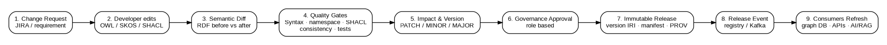
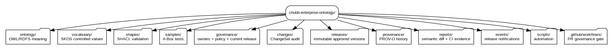
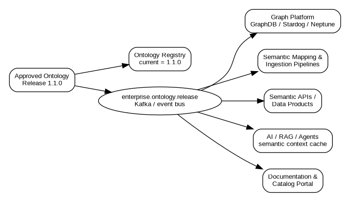

# Chubb Enterprise Ontology Change Governance, Versioning and Automation Guide

**Audience:** Junior ontology developers, knowledge engineers, data architects, ontology stewards, domain SMEs, platform engineers, reviewers and release managers  
**Purpose:** Define how an enterprise ontology is changed safely every day, how a class/property/concept is tracked, how releases are versioned, and how approved changes automatically propagate to consuming systems.  
**Status:** Implementation blueprint and runnable training example  
**Example organization:** Chubb  
**Date:** August 19, 2026

> **Important:** This document is an illustrative enterprise implementation guide. The Chubb namespace examples follow the Chubb-oriented ontology documentation supplied for this work. They should be reconciled with Chubb internal architecture, DNS, security, legal, records-retention, Git hosting and release-management policies before production use. The sample project contains no confidential Chubb data.

---

## 1. Executive summary

An enterprise ontology is a shared semantic contract. A developer changing one `rdfs:subClassOf`, domain/range, SHACL cardinality, SKOS concept or class definition can affect data pipelines, inferred knowledge, APIs, analytics and AI systems. Therefore ontology changes must never be managed as informal file edits.

Chubb should manage ontology evolution using the following model:

1. **Keep term IRIs stable.** `policy:Policy` remains the same enterprise concept across releases. Do not create `Policy_v2`, `Policy_2026` or `PolicyNew` for normal evolution.
2. **Version the ontology/module release.** Use immutable release versions such as `1.4.0` and OWL `owl:versionIRI` in released artifacts.
3. **Track every change as a ChangeSet.** Record what changed, why, who authored it, ticket/requirement, semantic impact, approver, commit and release.
4. **Compare RDF meaning, not file text.** Turtle formatting changes must not produce false governance alerts. The pipeline performs a semantic triple/axiom diff.
5. **Classify changes by consumer impact.** Editorial = PATCH, backward-compatible additions = MINOR, inference/data-contract breaking changes = MAJOR.
6. **Automate all repeatable checks.** Syntax, namespaces, ontology consistency, SHACL, test data, semantic diff, impact classification, version recommendation and report generation run automatically.
7. **Require human approval for semantic risk.** Automation detects and recommends; governance approves changes that can affect consumers.
8. **Publish only approved releases.** A developer save may trigger local analysis, but production consumers react only to an approved release event.
9. **Keep immutable history.** Every approved release is stored unchanged, together with a manifest, semantic change report and PROV-O provenance record.
10. **Propagate through an event.** After approval, the release pipeline updates the ontology registry and publishes an `ONTOLOGY_RELEASED` event so graph platforms, semantic APIs, data mappings, documentation and AI/RAG services can refresh safely.

This guide includes a runnable project that implements these principles.



---

## 2. The mental model for a junior developer

Think of ontology development as changing a contract used by many teams.

A Java/Python implementation bug may affect one application. A semantic ontology change can affect any system that uses the concept. For example:

```turtle
policy:CommercialPolicy rdfs:subClassOf policy:Policy .
```

If somebody changes it to:

```turtle
policy:CommercialPolicy rdfs:subClassOf core:Agreement .
```

then `CommercialPolicy` is no longer necessarily inferred to be a `Policy`. Queries such as:

```sparql
SELECT ?x WHERE { ?x a policy:Policy }
```

may return different results after reasoning. This is not just a code-line change; it is a semantic contract change.

A junior developer therefore follows this rule:

> **Edit freely in a feature branch; release only through the governance pipeline.**

The daily sequence is:

```text
Requirement -> branch -> edit -> save -> local governance check
           -> commit -> pull request -> automated governance gate
           -> steward/architect approval -> merge -> release
           -> registry + event -> controlled consumer refresh
```

---

## 3. Chubb example domain used in this guide

Chubb publicly describes insurance offerings for individuals and businesses and a broad claims operation. The training project therefore uses familiar insurance concepts such as:

- `Policy`
- `CommercialPolicy`
- `PersonalPolicy`
- `Coverage`
- `Claim`
- `Party`
- `Person`
- `Organization`
- Claim status controlled vocabulary

The examples are intentionally small. A production enterprise model would contain additional modules for underwriting, insured risk, location, product, coverage terms, premium, broker/agent, claims handling, payments, legal entities, reinsurance, finance, document semantics and regional extensions.

---

## 4. Non-negotiable governance principles

### GOV-01 - One authoritative semantic fact

Do not encode the same business rule independently in multiple files.

- **OWL/RDFS** owns semantic meaning and inference.
- **SHACL** owns data acceptance/validation constraints.
- **SKOS** owns controlled values/taxonomies.
- **A-Box sample/test data** demonstrates and tests usage.
- **SPARQL competency questions** test business requirements.
- **Generated JSON-LD/API schemas** are projections, not competing sources of truth.

### GOV-02 - Stable term identity

The IRI of a concept is its permanent enterprise identity.

Correct:

```text
https://data.chubb.com/ontology/ins/policy/Policy
```

Incorrect:

```text
.../Policy_v2
.../PolicyV3
.../Policy_2026
.../NewPolicy
```

A new IRI is minted only when a genuinely different concept is created or the old concept cannot preserve its original meaning.

### GOV-03 - Released artifacts are immutable

Anything under `releases/<version>/` must never be edited in place. A correction creates another release.

### GOV-04 - Semantic impact determines version level

Line count does not determine release level. One changed axiom may be MAJOR.

### GOV-05 - Git is necessary but not sufficient

Git answers source-control questions. Enterprise semantic governance additionally needs machine-readable semantic differences, provenance, approvals, impact and release identity.

### GOV-06 - Automatic detection, controlled publication

A file save may automatically run analysis. It must not automatically change production ontology state.

### GOV-07 - All meaningful changes have a business reason

Every change must be traceable to a ticket, requirement, defect, regulatory request, architecture decision or governed reference-data request.

---

## 5. Recommended enterprise repository structure

The runnable demo uses the following structure and this is the recommended starting pattern for a Chubb repository.



```text
chubb-enterprise-ontology/
|
|-- ontology/                         # Authoritative T-Box: OWL/RDFS
|   |-- fnd/                          # Enterprise foundation modules
|   |   |-- core.ttl
|   |   |-- party.ttl
|   |   `-- agreement.ttl
|   |
|   |-- ins/                          # Shared insurance domain
|   |   |-- policy.ttl
|   |   |-- claim.ttl
|   |   |-- coverage.ttl
|   |   `-- underwriting.ttl
|   |
|   |-- commercial/                   # Optional line-of-business extensions
|   |-- personal/
|   |-- life/
|   `-- misc/                         # Governance/meta modules
|
|-- vocabulary/                       # SKOS controlled value schemes
|   |-- ins/
|   |   |-- claim-status.ttl
|   |   |-- peril.ttl
|   |   `-- line-of-business.ttl
|   `-- ...
|
|-- shapes/                           # SHACL validation contracts
|   |-- ins/
|   |   |-- policy.shacl.ttl
|   |   `-- claim.shacl.ttl
|   `-- ...
|
|-- samples/                          # Test A-Box data only
|   |-- positive/
|   |-- negative/
|   `-- regression/
|
|-- competency/                       # Business questions + SPARQL tests
|   |-- policy/
|   `-- claim/
|
|-- mappings/                         # External alignment/mapping modules
|   |-- acord/
|   |-- fibo/
|   `-- internal-source-systems/
|
|-- governance/
|   |-- ontology-governance.yaml      # Normative automation policy
|   |-- owners.yaml                   # Steward/reviewer ownership
|   |-- namespace-registry.yaml       # Prefix + namespace registry
|   `-- release-state.json            # Currently approved release
|
|-- changes/                          # Machine-readable ChangeSets
|   |-- CHANGE_TEMPLATE.yaml
|   `-- CHG-2026-0452.json
|
|-- releases/                         # Immutable snapshots
|   |-- 1.0.0/
|   |-- 1.1.0/
|   `-- 2.0.0/
|
|-- provenance/                       # PROV-O audit graph
|   |-- CHG-2026-0452.ttl
|   `-- ...
|
|-- reports/                          # CI evidence / semantic diff
|   `-- latest/
|
|-- events/                           # Demo event output; Kafka in production
|
|-- docs/                             # Human documentation
|
|-- scripts/                          # Governance automation
|   |-- govern.py
|   |-- watch.py
|   |-- release.py
|   `-- impact_query.py
|
|-- .github/workflows/                # Or Jenkins/GitLab equivalent
|   `-- ontology-governance.yml
|
|-- requirements.txt
|-- Makefile
`-- README.md
```

### Why the directories are separate

A common enterprise failure is mixing ontology, code lists, examples and validation into one large TTL file. Separate directories make ownership and release behavior explicit.

| Directory | Owns | Typical change owner | Can change independently? |
|---|---|---|---|
| `ontology/` | Meaning/inference | Ontology engineer | Yes, governed |
| `vocabulary/` | Controlled values | Reference-data steward | Yes |
| `shapes/` | Data acceptance | Data/ontology governance | Yes |
| `samples/` | Test facts | Engineers | Yes |
| `mappings/` | External alignment | Integration/model team | Yes |
| `releases/` | Approved history | Release pipeline | No manual edits |
| `provenance/` | Audit history | Pipeline | No manual rewriting |

---

## 6. Namespace and IRI policy

The supplied Chubb-oriented ontology guidance uses `https://data.chubb.com/` and separates artifact kinds by root. Keep that policy consistent unless Chubb architecture governance formally changes it.

### 6.1 Roots

```text
https://data.chubb.com/ontology/     OWL/RDFS schema
https://data.chubb.com/vocabulary/   SKOS controlled vocabularies
https://data.chubb.com/shapes/       SHACL shapes
https://data.chubb.com/resource/     A-Box/business resources
```

### 6.2 Module namespace

Pattern:

```text
https://data.chubb.com/{root}/{layer}/{module}/
```

Examples:

```text
https://data.chubb.com/ontology/fnd/core/
https://data.chubb.com/ontology/ins/policy/
https://data.chubb.com/ontology/ins/claim/
https://data.chubb.com/vocabulary/ins/claim-status/
https://data.chubb.com/shapes/ins/policy/
```

### 6.3 Term IRI

```text
Module namespace + local name
```

Example:

```text
https://data.chubb.com/ontology/ins/policy/Policy
```

### 6.4 Naming

- Class: `UpperCamelCase` - `CommercialPolicy`
- Object property: `lowerCamelCase` - `hasCoverage`
- Datatype property: `lowerCamelCase` - `policyNumber`
- Shape: `{ClassName}Shape` - `PolicyShape`
- SKOS concept: readable stable token - `UnderReview`
- Prefix: lowercase, short and registered - `policy:`, `claim:`, `core:`
- Module directory: lowercase, singular and stable

### 6.5 Never embed release versions in term IRIs

Correct:

```turtle
policy:Policy a owl:Class .
```

Wrong:

```turtle
policy:Policy_v2 a owl:Class .
```

---

## 7. Ontology release identity

OWL provides ontology-level identity and version identity. A released policy module should look conceptually like:

```turtle
<https://data.chubb.com/ontology/ins/policy/>
    a owl:Ontology ;
    owl:versionIRI
        <https://data.chubb.com/ontology/ins/policy/1.1.0> ;
    owl:versionInfo "1.1.0" .
```

The ontology IRI is stable. The version IRI is immutable and release-specific.

### Recommended source/release behavior

In the runnable demo:

- Editable source files do **not** need developers to manually maintain `owl:versionIRI`.
- The release builder injects the approved version into the immutable snapshot.
- This prevents version-bump merge conflicts and ensures the release record and ontology metadata cannot disagree.

Organizations that require source files to contain the proposed version can do so, but the CI pipeline must then validate that it matches the governance decision.

---

## 8. How to version individual classes and properties

Do not version the class by changing its IRI. Track its evolution through ChangeSets and releases.

Example stable class:

```text
policy:Policy
```

Possible history:

```text
Release 1.0.0 - introduced Policy
Release 1.0.1 - corrected definition text
Release 1.1.0 - added optional relation hasProducer
Release 2.0.0 - changed an inference-sensitive superclass/restriction
```

A governance query should be able to answer:

- When was `Policy` introduced?
- Which releases changed it?
- What axioms changed?
- Who authored the change?
- Who approved it?
- What requirement/ticket caused it?
- Was it breaking?
- Which consumers were impacted?

That history lives in Git + ChangeSet + release manifest + PROV-O graph.

---

## 9. ChangeSet - the unit of governance

Every governed change should have a ChangeSet identifier.

Example:

```yaml
changeId: CHG-2026-0452
ticket: ONTO-452
author: jane.developer
reason: Add CyberPolicy to support the commercial cyber product semantic model.
module: ontology/ins/policy.ttl
requestedImpact: auto
migrationNotes: none
```

The pipeline enriches it automatically with:

- Git author name/email
- Git commit SHA
- pull request number
- timestamps
- changed entities
- added/removed axioms
- validation result
- detected impact
- suggested version
- approvers
- release number

### Why not ask developers to type all audit data?

Because manual audit fields drift. Identity, commit and timestamps should be captured from source systems wherever possible. The developer should provide the business reason and ticket; automation supplies technical evidence.

---

## 10. Semantic versioning policy for ontology releases

Use `MAJOR.MINOR.PATCH`, but interpret it using semantic impact.

### 10.1 PATCH - editorial/non-semantic

Examples:

- Correct `rdfs:label`
- Improve `rdfs:comment`
- Add definition/example
- Correct spelling
- Add documentation annotation that does not change reasoning/data acceptance

Example:

```text
1.0.0 -> 1.0.1
```

### 10.2 MINOR - backward-compatible additive semantic change

Examples:

- Add a new class
- Add a new property
- Add a new SKOS concept
- Add a new optional mapping
- Add an extension module
- Add a new child class under an existing hierarchy when existing terms keep their meaning

Example:

```text
1.0.0 -> 1.1.0
```

### 10.3 MAJOR - breaking or inference-sensitive change

Examples:

- Remove a class/property/concept
- Rename/move an IRI
- Change superclass of an existing class
- Change `rdfs:domain` or `rdfs:range`
- Add/remove `owl:disjointWith`
- Add/remove `owl:equivalentClass`
- Change OWL restrictions/cardinality
- Tighten a SHACL rule that rejects data previously accepted
- Change property characteristics such as functional/transitive/inverse semantics
- Reinterpret an existing concept so its old meaning is no longer preserved

Example:

```text
1.4.3 -> 2.0.0
```

### 10.4 Conservative default

When automation cannot determine impact confidently, classify as **MAJOR or manual-review-required**, not PATCH.

---

## 11. Worked example A - add `CyberPolicy`

Current hierarchy:

```turtle
policy:CommercialPolicy
    a owl:Class ;
    rdfs:subClassOf policy:Policy .
```

Developer adds:

```turtle
policy:CyberPolicy
    a owl:Class ;
    rdfs:subClassOf policy:CommercialPolicy ;
    rdfs:label "Cyber Policy"@en .
```

Expected governance result:

```text
Changed file: ontology/ins/policy.ttl
Added entity: policy:CyberPolicy
Added semantic axiom: CyberPolicy subClassOf CommercialPolicy
Impact: MINOR
Current version: 1.0.0
Suggested version: 1.1.0
Approval: Policy module steward
```

Why MINOR? Existing concepts keep their previous meaning; a new child concept is added.

---

## 12. Worked example B - change an existing superclass

Before:

```turtle
policy:CommercialPolicy rdfs:subClassOf policy:Policy .
```

After:

```turtle
policy:CommercialPolicy rdfs:subClassOf core:Agreement .
```

Expected result:

```text
Removed axiom: CommercialPolicy subClassOf Policy
Added axiom: CommercialPolicy subClassOf Agreement
Impact: MAJOR
Suggested: 2.0.0 from 1.0.0
```

Why MAJOR? Existing inference and query results may change.

---

## 13. Worked example C - annotation-only change

Before:

```turtle
policy:Policy rdfs:comment "Insurance agreement."@en .
```

After:

```turtle
policy:Policy rdfs:comment "Insurance agreement represented by the enterprise semantic model."@en .
```

Expected:

```text
Impact: PATCH
1.0.0 -> 1.0.1
```

---

## 14. Worked example D - SHACL tightening

Before:

```turtle
sh:property [
    sh:path policy:policyNumber ;
    sh:minCount 0
] .
```

After:

```turtle
sh:property [
    sh:path policy:policyNumber ;
    sh:minCount 1
] .
```

This can reject data that previously passed. Treat it as a breaking data-contract change unless the shape is explicitly non-production/advisory.

Expected:

```text
Impact: MAJOR
Requires data-quality impact report and consumer migration plan
```

---

## 15. Daily developer workflow

### Step 1 - receive/confirm a governed requirement

A change begins with a ticket or equivalent record.

Minimum information:

- business problem
- requested concept/property/value change
- domain/module
- business SME
- acceptance criteria
- expected consumer impact if known

### Step 2 - create feature branch

Example:

```bash
git checkout -b feature/ONTO-452-add-cyber-policy
```

Recommended convention:

```text
feature/<ticket>-<short-description>
fix/<ticket>-<short-description>
breaking/<ticket>-<short-description>
```

Branch naming is informational; the governance engine still calculates actual impact.

### Step 3 - edit only authoritative artifacts

If the requirement changes semantic meaning, edit `ontology/`.

If it changes a controlled value, edit `vocabulary/`.

If it changes acceptance rules, edit `shapes/`.

Do not manually edit `releases/`, generated reports or historical PROV records.

### Step 4 - save and run local governance

```bash
python scripts/govern.py
```

Or run the watcher:

```bash
python scripts/watch.py
```

Every TTL save triggers the same analysis.

### Step 5 - inspect report

```text
reports/latest/change-report.md
reports/latest/change-report.json
```

Developer verifies:

- correct file detected
- intended entity detected
- no accidental deletions
- expected impact level
- validation PASS

### Step 6 - commit

```bash
git add ontology/ins/policy.ttl
git commit -m "ONTO-452 add CyberPolicy concept"
```

### Step 7 - pull request

The PR pipeline reruns the governance gate from a clean environment.

### Step 8 - reviewers approve by impact

PATCH: ontology engineer/reviewer  
MINOR: module steward  
MAJOR: module steward + enterprise ontology architect + domain SME; data/product owner where consumer migration is required

### Step 9 - merge

Only passing and approved PRs merge to the protected branch.

### Step 10 - release pipeline

The release step produces immutable artifacts and publishes the release event.

---

## 16. Local watcher - what triggers when a file is saved

The sample watcher monitors:

```text
ontology/**/*.ttl
vocabulary/**/*.ttl
shapes/**/*.ttl
samples/**/*.ttl
```

On a filesystem change:

```text
File Save
  |
  +--> Parse all Turtle
  +--> Compare current graph with approved release
  +--> Produce semantic RDF diff
  +--> Namespace rules
  +--> Basic consistency checks
  +--> SHACL/sample validation
  +--> Classify PATCH/MINOR/MAJOR
  +--> Recommend version
  `--> Write report
```

The watcher **does not create a release**.

This gives developers fast feedback without bypassing governance.

---

## 17. Pull request CI pipeline

The supplied demo contains:

```text
.github/workflows/ontology-governance.yml
```

Trigger paths include:

```yaml
ontology/**/*.ttl
vocabulary/**/*.ttl
shapes/**/*.ttl
samples/**/*.ttl
governance/**
scripts/**
```

Recommended PR stages:

1. Checkout complete Git history.
2. Install governance dependencies.
3. Parse all RDF/Turtle artifacts.
4. Validate namespace/IRI policy.
5. Detect import cycles.
6. Verify module metadata.
7. Semantic diff against current approved baseline.
8. OWL profile/consistency reasoning.
9. SHACL validation.
10. Run positive and negative sample tests.
11. Run competency-question SPARQL regression tests.
12. Detect deleted/renamed terms.
13. Run downstream dependency impact query.
14. Compute recommended SemVer.
15. Verify ChangeSet/ticket.
16. Produce Markdown + JSON report.
17. Enforce required reviewers based on ownership/impact.
18. Block merge on errors.

### Production tool substitutions

The runnable project intentionally has minimal dependencies. In a production Chubb implementation, integrate enterprise-approved tools such as:

- full OWL reasoner/profile validator
- `pySHACL` or platform-native SHACL engine
- SPARQL regression runner
- enterprise dependency catalog
- GitHub Enterprise/GitLab/Jenkins approval controls
- artifact repository
- signing/attestation
- Kafka/event infrastructure
- ontology registry/catalog

---

## 18. Semantic diff - compare meaning, not text

Turtle is a serialization. The following can represent the same RDF graph:

```turtle
policy:Policy a owl:Class ; rdfs:label "Policy"@en .
```

and:

```turtle
policy:Policy
    rdfs:label "Policy"@en ;
    a owl:Class .
```

A normal text diff shows changes. A semantic diff should show **no semantic change**.

The sample project canonicalizes RDF graph meaning and ignores generated release metadata such as:

- `owl:versionIRI`
- `owl:versionInfo`
- release date metadata

This prevents false version bumps caused by serialization or release packaging.

---

## 19. Impact analysis

A good ontology governance pipeline should not stop at “this triple changed.” It should answer what depends on it.

For `policy:Policy`, impact may include:

```text
policy:Policy
|
|-- subclass <- CommercialPolicy
|-- subclass <- PersonalPolicy
|-- SHACL <- PolicyShape
|-- property <- policyNumber
|-- property <- hasCoverage
|-- mapping <- ACORD policy mapping
|-- query <- CQ-POL-001
|-- consumer <- Policy Semantic API
|-- consumer <- Claims ingestion
`-- consumer <- AI/RAG semantic context
```

### Recommended dependency registry

Capture dependencies as machine-readable relationships:

```turtle
consumer:ClaimsPipeline gov:dependsOn policy:Policy .
consumer:PolicyAPI gov:dependsOn policy:Policy .
cq:CQ-POL-001 gov:testsTerm policy:Policy .
map:ACORDPolicy gov:mapsTerm policy:Policy .
```

Then the PR report can say:

```text
Changing policy:Policy may affect:
- 2 ontology descendants
- 1 SHACL shape
- 2 semantic properties
- 1 mapping
- 1 competency question
- 3 registered consumers
```

---

## 20. Governance roles and approval matrix

### Enterprise Ontology Architect

Accountable for:

- enterprise modeling standards
- foundation ontology
- namespace policy
- breaking semantic decisions
- cross-domain consistency
- exceptions/waivers

### Module Steward

Accountable for:

- policy/claim/etc. module quality
- terminology alignment with SMEs
- reviewing additive semantic changes
- deprecation decisions

### Ontology Engineer

Responsible for:

- implementing OWL/RDFS/SKOS/SHACL changes
- tests
- ChangeSet reason/ticket
- resolving pipeline findings

### Domain SME

Responsible for confirming business meaning.

### Data/Product Owner

Responsible for consumer compatibility and migration where relevant.

### Semantic Platform/DevOps

Responsible for:

- CI/CD
- registry
- artifact publication
- graph deployment
- release events
- rollback automation

### RACI-style approval

| Change | Engineer | Module Steward | Enterprise Architect | SME | Data/Product Owner |
|---|---|---|---|---|---|
| Label/comment | R/A | Optional | - | Optional | - |
| New class/property | R | A | Consult if cross-domain | C | C |
| New SKOS value | R | A/reference steward | - | C | C |
| New SHACL warning | R | A | - | C | C |
| Tighten required SHACL | R | A | A | C | A |
| Change superclass/domain/range | R | A | A | A | C/A |
| Remove/rename IRI | R | A | A | A | A |
| Foundation ontology change | R | A | A | C | C |

---

## 21. Deprecation - do not delete immediately

When a concept should no longer be used:

1. Keep its IRI resolvable.
2. Mark it deprecated.
3. Add replacement/migration guidance.
4. Stop allowing new use through governance/SHACL as appropriate.
5. Preserve it through a defined compatibility window.
6. Remove only in a governed MAJOR release if enterprise policy permits physical removal.

Example:

```turtle
policy:LegacyPolicyType
    a owl:Class ;
    owl:deprecated true ;
    dct:isReplacedBy policy:PolicyType ;
    rdfs:comment "Deprecated in release 2.3.0. Use policy:PolicyType."@en .
```

Never reuse the deprecated IRI for a different meaning.

---

## 22. Provenance strategy using PROV-O

PROV-O models responsibility and generation using entities, activities and agents.

For ontology governance:

- **Activity:** ChangeSet/release activity
- **Agent:** developer, steward, system
- **Entity:** release artifact, ontology module, report

Illustrative output:

```turtle
<.../CHG-2026-0452>
    a prov:Activity ;
    dct:identifier "CHG-2026-0452" ;
    dct:description "Add CyberPolicy..." ;
    prov:wasAssociatedWith <.../agent/jane.developer> ;
    prov:generated <.../Release-1.1.0> .

<.../Release-1.1.0>
    a prov:Entity ;
    dct:hasVersion "1.1.0" ;
    prov:wasGeneratedBy <.../CHG-2026-0452> .
```

This history can itself be stored as a governance knowledge graph.

---

## 23. Git identity and audit identity

Do not make the developer type `changedBy` in Turtle.

Capture automatically from:

- Git commit author
- authenticated Git platform account
- enterprise directory identity
- PR reviewer identity
- release-service identity

Then normalize to a governed agent IRI.

Example:

```text
jane.developer@company.com
            |
            v
https://data.chubb.com/resource/agent/jane.developer
```

Production should use an immutable enterprise subject/employee identity rather than email if corporate identity standards require it.

---

## 24. Approved release pipeline

The release pipeline runs only after validation and approval.

```text
Approved Merge
    |
    v
Re-run governance from clean main branch
    |
    v
Determine approved version
    |
    v
Create immutable release directory/artifact
    |
    v
Inject owl:versionIRI + versionInfo
    |
    v
Create release manifest
    |
    v
Create PROV-O ChangeSet
    |
    v
Sign/store artifact (production)
    |
    v
Update ontology registry current pointer
    |
    v
Publish ONTOLOGY_RELEASED event
```

### Release manifest example

```json
{
  "releaseId": "REL-1.1.0",
  "version": "1.1.0",
  "previousVersion": "1.0.0",
  "changeId": "CHG-2026-0452",
  "ticket": "ONTO-452",
  "approvedBy": "Policy Ontology Steward",
  "impact": "MINOR",
  "changedFiles": ["ontology/ins/policy.ttl"]
}
```

---

## 25. Automatic propagation after an approved change

Approved change propagation should be event driven.



Example event:

```json
{
  "eventType": "ONTOLOGY_RELEASED",
  "organization": "Chubb",
  "ontologyBundle": "enterprise",
  "previousVersion": "1.0.0",
  "version": "1.1.0",
  "changeId": "CHG-2026-0452",
  "ticket": "ONTO-452",
  "impact": "MINOR",
  "approvedBy": "Policy Ontology Steward",
  "changedFiles": ["ontology/ins/policy.ttl"]
}
```

### Production topic

Illustrative:

```text
enterprise.ontology.release
```

Follow Chubb enterprise event-naming/security standards for the actual topic.

### Typical subscribers

1. **Ontology registry** - sets current approved release.
2. **Graph publication service** - loads/replaces the governed schema named graph.
3. **Semantic ingestion pipelines** - refresh mappings/cache where needed.
4. **API/data-product metadata services** - update semantic contracts.
5. **Documentation portal** - regenerate human docs/diagrams.
6. **AI/RAG services** - invalidate ontology-derived context cache and reload approved semantic context.
7. **Dependency catalog** - update entity-to-consumer relationships.
8. **Monitoring** - record rollout and failed consumer refreshes.

### Critical rule

Consumers subscribe to **release events**, not developer Git commits or filesystem saves.

---

## 26. Graph database deployment strategy

Do not overwrite the only copy of an ontology graph with no rollback path.

Recommended named-graph pattern:

```text
https://data.chubb.com/graph/ontology/enterprise/1.0.0
https://data.chubb.com/graph/ontology/enterprise/1.1.0
https://data.chubb.com/graph/ontology/enterprise/2.0.0
```

Maintain a registry record for the currently active version.

For platforms that use one active schema graph, retain the prior release artifact and automate rollback.

### Promotion environments

```text
DEV -> TEST -> UAT -> PROD
```

The **same release artifact** should be promoted. Do not rebuild a semantically different ontology separately in each environment.

---

## 27. Rollback strategy

Rollback is a release operation, not an ad-hoc edit.

If release `1.2.0` causes a critical consumer problem:

1. Stop further rollout.
2. Mark deployment incident.
3. Set active registry pointer back to `1.1.0`.
4. Reload/promote the prior immutable artifact.
5. Publish an ontology rollback/deployment event.
6. Do not delete `1.2.0`; it remains part of audit history.
7. Fix in a new release.

For data migrations caused by MAJOR changes, rollback must include a data compatibility plan.

---

## 28. Emergency changes

Emergency does not mean ungoverned.

A fast-track process may reduce approval time but must retain:

- ticket/incident
- semantic diff
- automated validation
- named accountable approver
- immutable release
- provenance
- post-change review

Never allow direct production TTL editing as the normal emergency process.

---

## 29. Definition of Ready for an ontology change

A change is ready for implementation when:

- [ ] Ticket exists.
- [ ] Business requirement is understandable.
- [ ] Target ontology/vocabulary/shape module is identified.
- [ ] Owning steward is known.
- [ ] Existing term reuse was checked.
- [ ] External standard reuse/alignment was considered.
- [ ] Expected data/consumer impact is recorded if known.
- [ ] Acceptance/competency question is defined for non-trivial semantics.

---

## 30. Definition of Done

A change is done only when:

- [ ] Turtle parses.
- [ ] Namespace rules pass.
- [ ] No unintended entity deletion/IRI change.
- [ ] OWL consistency/profile gate passes.
- [ ] SHACL tests pass.
- [ ] Competency/regression tests pass.
- [ ] Semantic diff reviewed.
- [ ] Impact/version classification accepted.
- [ ] ChangeSet/ticket linked.
- [ ] Required reviewers approved.
- [ ] Immutable release created.
- [ ] PROV/release manifest created.
- [ ] Registry updated.
- [ ] Release event published.
- [ ] Consumer rollout monitored.
- [ ] Documentation/changelog updated.

---

## 31. What the runnable sample project implements

The provided project is intentionally executable on a developer laptop.

### It implements

- Chubb-style ontology namespaces
- foundation/policy/claim modules
- SKOS claim-status vocabulary
- SHACL policy/claim shapes
- sample A-Box data
- current approved baseline release `1.0.0`
- semantic RDF graph diff
- namespace validation
- lightweight consistency validation
- SHACL validation using `pySHACL` when available, with a built-in demo fallback
- automatic PATCH/MINOR/MAJOR classification
- automatic version recommendation
- Markdown/JSON change report
- local watcher
- GitHub Actions PR gate
- approved release builder
- immutable release folder
- PROV-O output
- ChangeSet JSON
- release-state registry
- simulated `ONTOLOGY_RELEASED` event

### It intentionally does not pretend to implement all enterprise infrastructure

Production Chubb should integrate enterprise-approved:

- identity and access control
- full OWL DL reasoner/profile tooling
- secrets/signing
- artifact repository
- Kafka/event bus
- GraphDB/Stardog/Neptune deployment
- enterprise metadata/catalog/dependency systems
- records retention/audit archival
- ServiceNow/JIRA integration
- approval APIs

---

## 32. Running the project - junior developer tutorial

### 32.1 Unzip and enter directory

```bash
cd chubb-ontology-governance-demo
```

### 32.2 Create Python virtual environment

Windows:

```powershell
python -m venv .venv
.venv\Scripts\activate
pip install -r requirements.txt
```

macOS/Linux:

```bash
python -m venv .venv
source .venv/bin/activate
pip install -r requirements.txt
```

The minimal runtime needs `rdflib` and `PyYAML`.

For full SHACL engine support:

```bash
pip install -r requirements-full.txt
```

### 32.3 Verify baseline

```bash
python scripts/govern.py
```

Expected key output:

```text
Baseline version : 1.0.0
Changed files    : 0
Semantic impact  : NONE
Suggested version: 1.0.0
Validation       : PASS
```

### 32.4 Start automatic watcher

Terminal A:

```bash
python scripts/watch.py
```

### 32.5 Make an additive ontology change

Terminal B:

```bash
python scripts/demo_change.py add-class
```

The watcher automatically detects the saved file and runs governance.

Expected:

```text
Changed files    : 1
Semantic impact  : MINOR
Suggested version: 1.1.0
Validation       : PASS
```

### 32.6 Inspect the report

```text
reports/latest/change-report.md
```

### 32.7 Reset to current approved baseline

```bash
python scripts/demo_change.py reset
```

### 32.8 Test a breaking change

```bash
python scripts/demo_change.py breaking-superclass
python scripts/govern.py
```

Expected:

```text
Semantic impact  : MAJOR
Suggested version: 2.0.0
```

### 32.9 Test an annotation-only change

```bash
python scripts/demo_change.py reset
python scripts/demo_change.py annotation-only
python scripts/govern.py
```

Expected:

```text
Semantic impact  : PATCH
Suggested version: 1.0.1
```

---

## 33. Create an approved release in the sample project

Reset, add the additive change and run governance:

```bash
python scripts/demo_change.py reset
python scripts/demo_change.py add-class
python scripts/govern.py
```

Release it:

```bash
python scripts/release.py \
  --approved-by "Policy Ontology Steward" \
  --ticket "ONTO-452" \
  --reason "Add CyberPolicy for the commercial cyber semantic model" \
  --change-id "CHG-2026-0452"
```

Expected outputs:

```text
releases/1.1.0/
releases/1.1.0/manifest.json
releases/1.1.0/change-report.json
releases/1.1.0/change-report.md
changes/CHG-2026-0452.json
provenance/CHG-2026-0452.ttl
events/ontology-release-latest.json
governance/release-state.json
```

Run:

```bash
python scripts/demo_change.py reset
python scripts/govern.py
```

Now the approved baseline is `1.1.0` and the source is compared to that release.

---

## 34. What happens if validation fails?

The governance report becomes `FAIL` and the release command refuses to release.

Examples:

- invalid Turtle syntax
- invalid governed namespace
- obvious version token embedded in class IRI
- contradictory disjoint typing detected by the demo
- sample A-Box violates a required SHACL rule

In production, the PR merge should also be blocked.

---

## 35. What happens if somebody only reformats Turtle?

Nothing semantic should happen.

The project compares RDF graph meaning, so changed indentation, prefix ordering or triple ordering does not create a release recommendation.

This rule is essential in ontology repositories because serialization tools such as Protégé/RDFLib may reorder Turtle.

---

## 36. What happens if a class is renamed?

Do not casually rename an IRI.

If only the human label changes:

```turtle
rdfs:label "Old Label" -> "Improved Label"
```

that is usually PATCH.

If the IRI changes:

```text
policy:Policy -> policy:InsurancePolicy
```

that is an identity change and normally MAJOR. Prefer preserving the IRI and changing its label unless the enterprise identity is genuinely wrong.

If a new IRI is unavoidable:

1. deprecate old IRI
2. create new IRI
3. add explicit migration/equivalence mapping only when semantically correct
4. publish migration guidance
5. notify consumers
6. MAJOR release

---

## 37. What happens if a controlled code changes?

For SKOS:

- new concept -> usually MINOR
- label correction -> PATCH
- delete/reassign business code -> MAJOR/reference-data migration
- change `skos:notation` used as an operational business code -> potentially MAJOR

A controlled vocabulary versions on its own clock in a mature platform, even when an enterprise bundle release also records the aggregate version.

---

## 38. What happens if a developer modifies an imported external ontology?

Do not edit W3C/ACORD/FIBO/vendor namespace content directly.

Instead:

1. pin/reuse canonical external artifact
2. create Chubb-owned mapping/extension module
3. express subclass/equivalence/mapping from the Chubb namespace
4. govern that mapping module

External canonical IRIs should remain canonical.

---

## 39. How AI/RAG consumers should react to ontology changes

AI consumers must not pull arbitrary working-tree ontology files.

Recommended pattern:

1. AI service stores `ontologyRelease=1.1.0` in its semantic context metadata.
2. Approved release event `1.2.0` arrives.
3. Service inspects impact and supported compatibility range.
4. It downloads/loads the approved artifact from registry/artifact store.
5. Rebuilds ontology-derived prompts, graph schema cache, entity/type dictionary or embeddings if required.
6. Records successful adoption.
7. If adoption fails, it remains on previous release and emits an operational alert.

For MAJOR ontology releases, AI/data consumers may require explicit compatibility certification before upgrade.

---

## 40. Governance knowledge graph - recommended next maturity level

Store governance itself as RDF.

Useful classes:

```text
Ontology
OntologyModule
OntologyVersion
OntologyEntity
ChangeSet
SemanticChange
ImpactAssessment
Approval
Release
Agent
Requirement
Ticket
ConsumerSystem
```

Useful relationships:

```text
hasVersion
previousVersion
changesEntity
introducedEntity
removedEntity
changedBy
approvedBy
implementsRequirement
associatedTicket
generatedRelease
affectsSystem
dependsOn
introducedInVersion
modifiedInVersion
```

Then Chubb can query:

```sparql
SELECT ?change ?who ?release ?reason
WHERE {
  ?change gov:changesEntity policy:Policy ;
          prov:wasAssociatedWith ?who ;
          prov:generated ?release ;
          dct:description ?reason .
}
```

This answers ontology audit questions without manually reading Git history.

---

## 41. Monitoring and operational metrics

Track at least:

- ontology changes per month
- PATCH/MINOR/MAJOR distribution
- validation failure rate
- time from PR to approval
- emergency change count
- deprecated terms still consumed
- consumers per ontology module
- failed consumer upgrades
- rollback count
- average migration lead time for MAJOR releases
- namespace violations
- unowned modules/terms
- stale competency questions

These metrics show whether governance is helping or merely creating paperwork.

---

## 42. Security and access control

Recommended baseline:

- protected main/release branches
- no direct pushes to main
- least-privilege release service account
- signed release artifacts where required
- controlled secrets for graph/Kafka publication
- audit log retained outside developer workstation
- separate author and approver for MAJOR changes where policy requires segregation of duties
- production graph write access only from deployment service

Ontology governance must integrate with Chubb information-security standards rather than invent a separate identity/control model.

---

## 43. Pull request review checklist

Reviewer should answer:

- [ ] Is there a valid ticket/business reason?
- [ ] Is the existing enterprise term reused where appropriate?
- [ ] Is the namespace correct?
- [ ] Is a new IRI actually necessary?
- [ ] Does the class/property name describe business meaning rather than source-system field names?
- [ ] Is OWL used for meaning rather than data rejection?
- [ ] Is SHACL used for acceptance constraints?
- [ ] Is SKOS used for controlled values?
- [ ] Are domain/range semantics intentional?
- [ ] Are superclass changes intentional?
- [ ] Are disjointness/restrictions justified?
- [ ] Does semantic diff match the requirement?
- [ ] Are there accidental deletions?
- [ ] Does impact analysis identify downstream consumers?
- [ ] Is version level appropriate?
- [ ] Are sample/regression tests present?
- [ ] Is migration guidance required?
- [ ] Are deprecated IRIs preserved?
- [ ] Are required approvers present?

---

## 44. Junior developer rules to remember

1. Never create `Class_v2` just because a class changed.
2. Never edit `releases/`.
3. Never edit an external canonical namespace.
4. Never treat Turtle text diff as semantic truth.
5. Never merge a failing governance report.
6. Never tighten SHACL without considering existing data.
7. Never change superclass/domain/range casually.
8. Never delete an enterprise IRI without a deprecation/migration plan.
9. Always link a business reason/ticket.
10. Always run the local governance check before PR.
11. Production changes only on approved release events.
12. When unsure about semantic impact, escalate rather than downgrade the version.

---

## 45. Recommended production roadmap

### Phase 1 - repository discipline

- standardized directories
- namespace registry
- ownership
- protected branches
- semantic diff
- baseline validation

### Phase 2 - CI governance

- OWL reasoner/profile
- pySHACL
- competency tests
- automatic impact/version recommendation
- PR reports
- approval policy

### Phase 3 - release automation

- immutable artifact repository
- version IRI injection
- PROV-O
- signed release manifest
- ontology registry
- promotion DEV/TEST/UAT/PROD

### Phase 4 - event-driven enterprise adoption

- Kafka release event
- graph deployment subscriber
- API/data pipeline subscribers
- AI/RAG subscriber
- documentation/catalog subscriber
- rollout telemetry

### Phase 5 - governance knowledge graph

- entity history
- dependency graph
- automated impact queries
- audit dashboards
- deprecation analytics

---

## 46. Standards basis

This guidance follows these established semantic-web concepts:

- OWL 2 supports ontology IRIs, version IRIs, ontology annotations and imports.
- PROV-O provides a model for entities, activities and agents and their provenance relationships.
- SHACL defines constraints for validating RDF graphs.
- SKOS defines a common RDF model for controlled knowledge-organization systems.

The supplied Chubb-oriented ontology documentation additionally defines the repository-specific namespace, modularization, versioning and artifact-separation conventions used throughout this guide.

---

## 47. References

1. W3C, **OWL 2 Web Ontology Language Structural Specification and Functional-Style Syntax (Second Edition)**: https://www.w3.org/TR/owl2-syntax/
2. W3C, **PROV-O: The PROV Ontology**: https://www.w3.org/TR/prov-o/
3. W3C, **SHACL 1.2 Core**: https://www.w3.org/TR/shacl12-core/
4. W3C, **SKOS Simple Knowledge Organization System Reference**: https://www.w3.org/TR/skos-reference/
5. Chubb US, public site describing business and personal insurance: https://www.chubb.com/us-en/
6. Chubb US, claims overview: https://www.chubb.com/us-en/claims.html
7. Supplied Chubb-oriented ontology documentation package: namespace policy, ontology versioning, ontology modularization, artifact organization, workflows/provenance, and RDFS/OWL/SHACL guidance.

---

## Appendix A - Runnable demo file map

```text
chubb-ontology-governance-demo/
|-- ontology/fnd/core.ttl
|-- ontology/ins/policy.ttl
|-- ontology/ins/claim.ttl
|-- vocabulary/ins/claim-status.ttl
|-- shapes/ins/policy.shacl.ttl
|-- shapes/ins/claim.shacl.ttl
|-- samples/valid-sample.ttl
|-- governance/ontology-governance.yaml
|-- governance/owners.yaml
|-- governance/release-state.json
|-- changes/CHANGE_TEMPLATE.yaml
|-- releases/1.0.0/...
|-- scripts/govern.py
|-- scripts/watch.py
|-- scripts/demo_change.py
|-- scripts/release.py
|-- scripts/impact_query.py
|-- .github/workflows/ontology-governance.yml
|-- README.md
`-- docs/
```

## Appendix B - Command cheat sheet

```bash
# baseline check
python scripts/govern.py

# watch changes continuously
python scripts/watch.py

# demonstrate a MINOR change
python scripts/demo_change.py add-class
python scripts/govern.py

# restore current release
python scripts/demo_change.py reset

# demonstrate a PATCH change
python scripts/demo_change.py annotation-only
python scripts/govern.py

# demonstrate a MAJOR change
python scripts/demo_change.py reset
python scripts/demo_change.py breaking-superclass
python scripts/govern.py

# inspect neighborhood/impact of Policy
python scripts/impact_query.py https://data.chubb.com/ontology/ins/policy/Policy

# create approved release after a passing change
python scripts/release.py \
  --approved-by "Policy Ontology Steward" \
  --ticket "ONTO-452" \
  --reason "Add CyberPolicy" \
  --change-id "CHG-2026-0452"
```

## Appendix C - Recommended enterprise CI quality gates

| Gate | Result on failure |
|---|---|
| RDF/Turtle parse | Block |
| Namespace/IRI lint | Block |
| Prefix registry | Block |
| Import cycle | Block |
| OWL profile | Block or approved exception |
| Reasoner consistency | Block |
| SHACL violations | Block based on severity policy |
| Positive sample tests | Block |
| Negative sample tests | Block if expected violations disappear |
| Competency questions | Block |
| Semantic diff | Report + review |
| Term deletion/IRI rename | MAJOR + block until migration approved |
| Impact analysis | Review required |
| Version classification | Block if inconsistent with policy |
| ChangeSet/ticket | Block |
| Ownership/reviewer policy | Block |
| Release manifest | Block release |
| Artifact signing/checksum | Block release in production |

## Appendix D - Final governance principle

> **A Chubb ontology concept has a stable enterprise identity. Its history is expressed through governed semantic ChangeSets and immutable ontology releases. Automation detects and validates change; accountable people approve semantic risk; only an approved release is allowed to change enterprise runtime meaning.**
